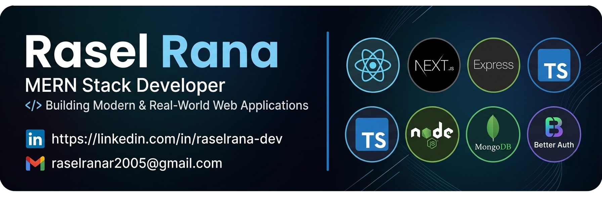

<!-- 🔥 Banner Image -->
<p align="center">
  
</p>

<!-- 👁 Profile Views -->
<p align="center">
  
</p>

<!-- 🧑‍💻 Typing Animation -->
<h1 align="center">
  
</h1>

<h3 align="center">
🚀 MERN Stack Developer  
</h3>

<p align="center">
React • Next.js • Node.js • MongoDB • TypeScript
</p>

<p align="center">
💡 Building Modern & Real-World Web Applications
</p>

---

## 👨‍💻 About Me

Hi, I'm Rasel 👋  
I am a passionate JavaScript developer who loves building modern and real-world web applications.  
I enjoy understanding how things work internally and solving real-life problems with code.

- 🔥 Currently exploring **Next.js**
- 🧠 Learning **JavaScript deeply (core + internal concepts)**
- ⚛️ Building projects using **React, Node.js & TypeScript**
- 🌍 Working on **real-world web applications**
- 🚀 Goal: Become a **high-level full-stack developer**

---

## 🌐 Connect With Me

<p align="center">
  <a href="https://www.linkedin.com/in/raselrana-dev/">
    
  </a>
  <a href="mailto:raselranar2005@gmail.com">
    
  </a>
</p>

---

## 🧰 Tech Stack

<p align="center">
  
</p>

---

## 📊 GitHub Stats

<p align="center">
  
  
</p>

<p align="center">
  
</p>

---

## 🎯 Current Focus

- 🔥 Mastering **TypeScript**
- ⚛️ Deep dive into **Nextjs**
- 🧩 Building **real-world projects**

---

## 🧠 Coding Profile

```javascript
const rasel = {
  role: "MERN Stack Developer",
  code: ["JavaScript", "HTML", "CSS"],
  tools: ["React", "Next.js", "Node.js", "Express", "MongoDB",TypeScript],
  currentFocus: "Deep TypeScript + Real Projects",
  futureGoal: "High-level Full Stack Developer",
};
